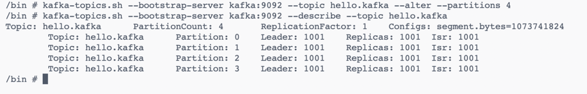

# 아파치 카프카 탄생

링크드인은 초기 단방향 파이프라인을 구성하여 소스 애플리케이션과 타깃 애플리케이션을 연결했다.  
시간이 지날수록 거대해지는 아키텍처는 데이터파이프라인의 복잡도를 증가시켰다.

아파치 카프카는 이러한 문제를 해결하기 위해 탄생했다.  

카프카는 각각의 애플리케이션끼리 연결하여 데이터를 처리하는 것이 아니라 한 곳에 모아 처리할 수 있도록 중앙집중화했다.   
카프카를 중앙에 배치함으로써 소스 애플리케이션과 타깃 애플리케이션 사이의 의존도를 최소화하여 커플링을 완화하였다.

카프카 내부에 데이터가 저장되는 파티션의 동작은 fifo 방식으로 큐 자료구조와 유사하다.

큐에 데이터를 보내는 것이 **프로듀서**.

큐에서 데이터를 가져가는 것이 **컨슈머**.

---

### 카프카로 보내는 데이터

카프카를 통해 전달할 수 있는 데이터 포멧은 사실상 제한이 없다.

byteArray로 통신하기 때문에 자바에서 선언 가능한 모든 객체를 지원한다.

---

### [운영 환경에서 카프카 구성](https://20h.dev/post/kafka/what-is-kafka/)

운영 환경에서 카프카는 최소 3대 이상의 서버(브로커)에서 분산 운영하여 프로듀서를 통해 전송받은 데이터를 파일 시스템에 안전하게 기록한다.

서버 3대 이상으로 이루어진 카프카 클러스터 중 일부 서버에 장애가 발생하더라도 데이터를 지속적으로 복제하기 때문에 안전하게 운영.

주키퍼는 카프카의 메타데이터를 관리하고, 브로커들이 안정적으로 동작할 수 있도록 도와준다. 주키퍼는 리더 선출과 같은 중요한 결정들을 하기 위해 퀘럼(Quorum) 메커니즘을 사용한다.

퀘럼은 주키퍼 인스턴스의 과반수가 동의해야만 결정이 유효하다는 것을 의미. 
예를 들어, 주키퍼 인스턴스가 5개 있는 경우, 최소 3개의 인스턴스가 동의해야 결정.

홀수 개의 주키퍼 인스턴스를 사용하는 이유는 과반수를 명확히 하기 위함이다. 

- 과반수 결정: 홀수 개의 인스턴스를 사용하면 과반수를 쉽게 계산할 수 있다.

- 높은 가용성: 홀수 개의 인스턴스를 사용하면 한 인스턴스가 다운되더라도 여전히 과반수를 유지할 수 있어 시스템의 가용성을 높일 수 있다.

- 리더 선출의 안정성: 주키퍼의 합의 프로토콜은 리더를 선출할 때 과반수의 동의를 필요. 홀수 개의 인스턴스를 사용하면 리더 선출 과정이 보다 안정적이고 신속하게 이루어질 수 있다.

따라서, 카프카 클러스터를 구성할 때 홀수 개의 주키퍼 인스턴스를 사용하는 것이 권장. 이는 카프카 클러스터의 안정성과 가용성을 보장하기 위한 중요한 전략이다.

---

### 왜 카프카인가

- 높은 처리량
  - 데이터를 묶음 단위로 처리하는 배치 전송 : 네트워크 비용 절감
- 확장성
  - 클러스터의 브로커 수를 늘리거나 줄일 수 있음
- 영속성
  - 전송 받은 데이터를 메모리가 아닌 파일 시스템에 저장하기에 장애로 인한 서비스 종료에도 안전하게 데이터 보관 가능
  - 파일 시스템에 저장하게 되면, 메모리에 저장하는 것에 비해 느릴 수 있다. 카프카는 이 문제를 해결하기 위해 운영체제에서 페이지 캐시 영역을 생성하여 한 번 읽은 파일을 메모리에 저장하는 방식을 활용.
- 고가용성
  - 카프카 클러스터는 3대 이상의 서버로 운영되기에 일부 서버 장애가 발생해도 무중단으로 안전하고 지속적인 데이터 처리가 가능

---

### 페이지 캐시

페이지 캐시는 디스크로부터 읽은 데이터나 디스크에 쓸 데이터를 메모리에 저장하는 버퍼 역할.
이는 자주 사용되는 데이터를 메모리에 캐시하여 디스크 접근 횟수를 줄일 수 있도록 한다.

카프카는 로그 데이터를 순차적으로 디스크에 쓴다. 
이 과정에서 데이터가 먼저 페이지 캐시에 저장. 
운영체제는 페이지 캐시에서 데이터를 모아서 한 번에 디스크에 쓰기 때문에, 디스크 I/O 효율이 높아진다.

---

### 실습

1. 카프카 컨테이너 구동 및 토픽 생성/조회

2. 카프카 토픽 상세 조회

3. 토픽 파티션 수 수정

4. 토픽 리텐션 시간 수정

