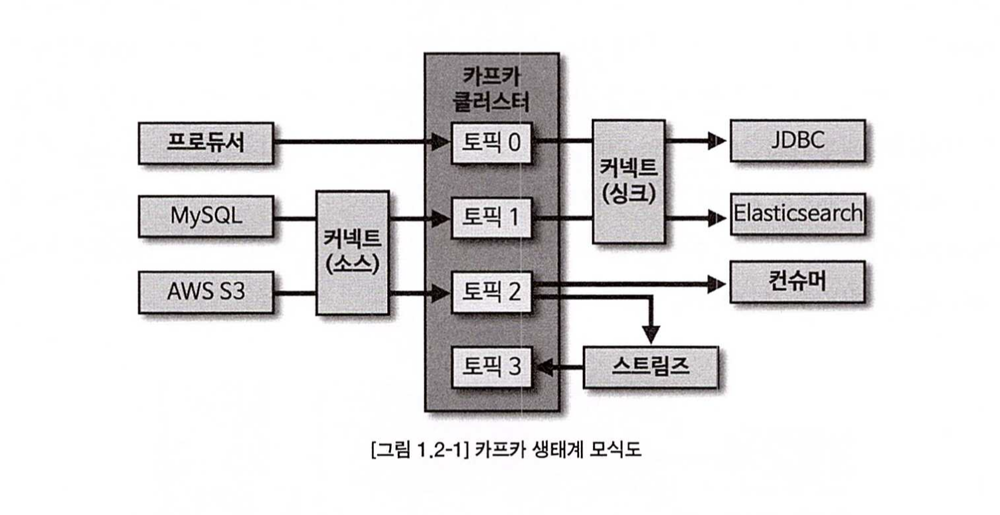

# 📌 서론

<aside>
✏️ 카푸카의 탄생 배경과 간단한 사용방법에 대해서 알아보자.

</aside>

# 🔥 카프카 탄생

- 링크드인에서 파편화된 데이터 수집 및 분배 아키텍처를 운영하는데 큰 어려움을 겪음.
- 단방향 통신으로 애플리케이션이 작을땐 문제가 없었다 거대해지고 복잡해지면서 문제.
    - 소스코드 및 버전 관리 이슈를 겪음.
    - 타깃 애플리케이션 장애가 생길 경우 소스 애플리케이션에서도 영향이 전파 됨.
        - 왜??? 어떻게 코드를 작성했길래..???
- 기존 오픈소스 및 ETL 툴로 아키텍쳐 변경의 노력을 했지만 잘 되지 않았다.
    - 결국 새로운 시스템을 만들기로 결정.
- 카푸의 주요 핵심은 데이터를 한곳에 모아 처리 할 수 있도록 중앙 집중화 함.
    - 기존에 타깃, 소스 애플리케이션 의존도를 낮추어 커풀링 완화.
        - 직접적으로 연결되어 있지 않으니
- 카푸카 큐(FIFO) 방식과 비슷하다.
    - 데이터를 보내는 것은 프로듀서
    - 데이터를 가져가는 것은 컨슈머 이다.
- 데이터 포맷은 제한이 없다.
    - 데이터 직렬화를 이용하여 바이트 어레이로 통신 하므로.
- 3대이상의 브로커를 통해 데이터를 파일시스템에 안전하게 보관함.
    - 데이터를 지속적으로 복제하므로 장애가 생기더라도 안전하게 운영 가능.

# 🔥 빅데이터 파이프라인에서 카프카의 역활

- 예전엔 비지니스를 수행하기 위한 최소한의 데이터만 저장하던것과 달리 지금은 사용자의 모든 데이터를 수집 함.(빅데이터)
    - 이것을 비정형데이터로 모아두는 곳을 데이터 레이크라 한다.
        - 정형데이터로 수집하기엔 무리가 따른다.
        - 데이터를 어디어 어떻게 쓸지 가능성을 열어 둬야 하기 때문.
- 서비스에서 발생하는 데이터를 수집하려면 어떻게 해야 될까?
    - 간단한 시스템에서는 end to end 방식으로 운영할 수 있겠지만 아키텍쳐가 복잡해 지면 데이터 파이프 라인을 구축해야 한다.
        - 데이터 파이프라인은 데이터 추출, 변환, 적재 과정을 말한다.
- 데이터 파이프 라인을 안정적이고 확장석 높게 운영하기 위한 좋은 방법중 하나가 바로 아파치 `카푸카를 활용`하는 것
- 높은 처리량
    - 카푸카는 데이터 보내고 받을 때 데이터를 묶어서 처리 하므로 네트워크 비용을 최소화 할 수 있다.
    - 따라서 대용량의 실시간 데이터를 처리하는 데에 적합 함.
    - 동일 목적의 데이터를 여러 파티션에 분배하고 데이터를 병렬 처리 할 수 있다.
    - 데이터를 파티션에 분배하여 병렬처리가 가능하다.
        - 파티션 개수만큼 컨슈머를 늘려 동일 시간당 데이터 처리량을 늘릴 수 있음.
- 확장성
    - 데이터가 많아지거나 적어지면 자연스럽게 스케일 인 아웃이 가능하여 무중단 운영이 가능
- 영속성
    - 데이터를 생성한 프로그램이 종료되더라도 데이터는 사라지지 않음.
    - 운영체제 기반의 파일 시스템을 최대한 활용 한다.
        - IO 향상을 위해 페이지 캐시영역을 따로 생성하여 사용.
            - 한번 읽은 영역을 메모리에 저장하여 사용하는 방식
    - 디스크 기반의 파일 시스템을 활용하여 장애 발생을 갑작스럽게 종료가 되더라도 프로세스를 재시작 하여 재처리가 가능
- 고가용성
    - 3개 이상의 서버로 운영되면 카프카 클러스터는 일부 서버가 장애가 발생하더라도 안전하고 지속적으로 데이터 처리가 가능.
    - 데이터 복제를 통해 고가용성의 특징을 가지게 됨.

## 카프카 생태계

아래와 같이 다른 미들웨어와의 연동도 잘되어 있어 데이터 생산성 높게 스트림을 구성할 수 있음.



# 🔥 데이터 레이크 아키텍처와 카프카의 미래

- 데이터 아키텍처는 2가지 종류가 있음.
    - 람다 아키텍처
        - 레거시 데이터 수집 플랫폼 단점
            - 실시간으로 생성되는 데이터들에 대한 인사이트를 애플리케이션에 빠르게 전달하지 못함.
            - 원천 데이터의 히스토리 파악이 힘듬
            - 데이터 가공으로 인한 데이터 파편화로 데이터 거버넌스를 지키기 어려움.
        - 레거시 데이터 수집 플랫폼을 개선하기 위해 구성한 아키텍처
            - 아키텍쳐
              

            - 기존 배치를 처리하는 부분 외에 스피드레이어를 추가
                - 실시간 ETL 작업을 처리하는 영역 위 아키텍쳐를 확인
        - 주요 3가지 레이어
            1. 배치 레이어 - 말 그대로 특정 시간과 타이밍에 데이터를 일괄 모아서 처리
            2. 서빙 레이어 - 가공된 데이터를 데이터 사용자 및 애플리케이션에서 사용할 수 있도록 데이터를 저장 함.
            3. 스피드 레이어 - 서비스에서 생성되는 원천 데이터를 실시간 분석용도로 사용.
                1. 카푸카는 아키텍트적으로 여기에 위치함.
    - 카파 아키텍처
        - 배치레이어를 스피드레이어에서 처리하는 것을 제외하고는 동일 함.
        - 데이터를 처리하는 배치, 스피드로 나뉘어 로직도 2벌로 관리 및 배치, 스피드로 융합 처리도 번거로움.
    - 스트리밍 데이터 레이크
        - 카파 아키텍처에서 서빙 레이어를 제거한 아키텍처
        - 카푸카에서 서빙레이어에 저장할 데이터를 보관할 수 있다면 굳이 서빙레이어가 필요없다.
        - 오히려 이중으로 관리되는 운영 리소스를 줄일 수 있다.
            - 해결해야될 문제점
                - 굳이 사용하지 않는 자원들을 유지할 필요가 없다.
                - 자주 사용하지 않는 데이터는 오브젝트 스토리지와 같은 값싼 저장소에서 보관.
                - 자주 사용하는 데이터만 브로커에서 사용하는 구분이 필요
                    - 와 이게 쉬울까…??
                    - 이것도 비용과 관리 비용이 만만치 않을 것 같은데..
                    - ksqlDB와 같은 주변 데이터 플랫폼이 필요 함.

# **카프카 커맨드 라인 툴**

## Docker로 구성

```yaml
version: '3.8'
services:
  zookeeper:
    image: wurstmeister/zookeeper
    container_name: zookeeper
    ports:
      - "2181:2181"
  kafka:
    image: wurstmeister/kafka:2.12-2.5.0
    container_name: kafka
    ports:
      - "9092:9092"
    environment:
      KAFKA_ADVERTISED_HOST_NAME: 127.0.0.1
      KAFKA_ZOOKEEPER_CONNECT: zookeeper:2181
    volumes:
      - /var/run/docker.sock:/var/run/docker.sock

```

docker 환경에서는 아래와 같이 접속이 가능하다.

```bash
docker exec -it {containerId} /bin/bash
```

컨테이너에 접속하여 사용한다. 

`/opt/kafka` 경로에 설치되어 있다.

## **kafka-topics.sh**

### **토픽 생성**

```
bin/kafka-topics.sh --create --bootstrap-server localhost:9092 --partitions 3 --config retention.ms=172800000 --topic my-topic

```


### **토픽 리스트 조회**

```
bin/kafka-topics.sh --bootstrap-server localhost:9092 --list

```


### **토픽 상세 조회**

```
bin/kafka-topics.sh --bootstrap-server localhost:9092 --describe --topic my-topic

```


### **토픽 옵션 수정**

```
bin/kafka-configs.sh --bootstrap-server localhost:9092 --entity-type topics --entity-name my-topic --alter --add-config retention.ms=86400000

```


## **kafka-console-producer.sh**

```
bin/kafka-console-producer.sh --bootstrap-server localhost:9092 --topic my-topic --property "parse.key=true" --property "key.separator=:"

```

## **kafka-console-consumer.sh**

```
bin/kafka-console-consumer.sh --bootstrap-server localhost:9092 --topic my-topic --property "print.key=true" --property "key.separator=:" --group my-group --from-beginning

```


## **kafka-consumer-groups.sh**

### **컨슈머 그룹 조회**

```
bin/kafka-consumer-groups.sh --bootstrap-server localhost:9092 --list

```


### **컨슈머 그룹 상세 조회**

```
bin/kafka-consumer-groups.sh --bootstrap-server localhost:9092 --group my-group --describe

```


## **kafka-verifiable-producer, consumer.sh**

### **데이터 전송하기**

```
bin/kafka-verifiable-producer.sh --bootstrap-server localhost:9092 --max-messages 1000 --topic verify-test

```


### **전송한 데이터 확인**

```
bin/kafka-verifiable-consumer.sh --bootstrap-server localhost:9092 --topic verify-test --group-id test-group

```


## **kafka-delete-records.sh**

test 토픽의 0번 파티션에 0부터 100까지 데이터가 있다고 가정한다. 0부터 50 오프셋을 지우고 싶으면 다음과 같이 입력한다.

### **delete-topic.json**

```json
{
  "partitions": [
    {
      "topic": "test",
      "partition": 0,
      "offset": 50
    }
  ]
}

```


```
bin/kafka-delete-records.sh --bootstrap-server localhost:9092 --offset-json-file delete-topic.json

```


# 🚀 결론

- 카프카가 탄생한 배경과 기술적 허들에 대해서 알아 보았다.
- 카프카 사용 용도와 간단한 조작법에 대해 알아 보았다.
- 기술의 발전으로 아키텍쳐는 점점 심플해지는 것을 몸으로 느낄 수 있었다.
- 다만 카프카에 너무 의존적인 것도 좋지 않을거라는 생각도 든다.
    - 커플링이 강한 만큼 또 부정적인 영향도 있기 마련이다.
- 러닝커브가 높지만 강력한 도구인 만큼 배울 동기는 충분한 것 같다.