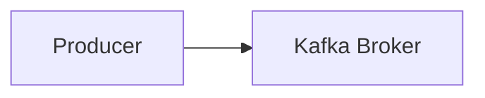

# 카프카 기본 개념 설명

## 카프카 브로커, 클러스터, 주키퍼

카프카 브로거 - 카프카 클러스터에 포함된 서버

- 데이터 분산 저장
- 하나의 서버에 한 개의 카프카 브로커 프로세스 실행
- 카프카 클러스터로 묶인 브로커들은 프로듀서가 보낸 데이터를 안전하게 분산 저장하고 복제

데이터 저장, 전송



프로듀서로부터 데이터를 전달 받으면, 카프카 브로커는 요청한 토픽의 파티션에 데이터를 저장하고, 컨슈머가 데이터를 요청하면 파티션에 저장된 데이터를 전달한다.

> 파티션 : 데이터를 저장하는 물리적인 단위

카프카는 메모리나 데이터베이스에 저장하지 않으며, 따로 캐시메모리를 구현하여 사용하지도 않는다.

카프카는 페이지 캐시를 사용하여 디스크 입출력 속도를 높여 "지속적인 파일 입출력에도 빠른 속도를 유지"한다.

> 페이지 캐시?
> OS에서 파일 입출력의 성능 향상을 위해 만들어 높은 메모리 영역을 뜻한다.
> 한번 읽은 파일의 내용은 메모리의 페이지 캐시 영역에 저장시킨다. 추후 동일한 파일의 접근이 일어나면 디스크가 아닌 메모리에서 직접 읽는 방식이다.


데이터 복제, 싱크

데이터 복제를 하는 이유
- 클러스터로 묶인 브로커 중 일부에 장애가 발생하더라도 데이터를 유실하지 않고 안전하게 사용하기 위함이다.

데이터 복제는 "파티션" 단위로 이루어진다. <br/>
토픽을 생성할 때, 파티션의 복제 개수도 같이 설정된다. <br/>
복제 개수의 최솟값은 1(복제 없음)이고 최댓값은 브로커 개수만큼 설정 가능하다.

복제된 파티션은 리더와 팔로워로 구성된다. <br/>
프로듀서 또는 컨슈머와 직접 통신하는 파티션을 리더, 나머지 복제 데이터를 가지고 있는 파티션을 팔로워라 부른다.

팔로워는 리더의 오프셋을 확인하여 현재 자신이 가지고 있는 오프셋과 차이가 나는 경우, 리더로부터 데이터를 가져와서 자신의 파티션에 저장한다. => 복제!

복제의 특징
- 장점: 데이터를 안전하게 사용할 수 있다. ( 때문에 운영 시에는 2이상의 복제 개수를 정하는 것이 중요 )
- 단점: 복제 개수만큼의 저장 용량이 증가

> 운영 시, <br/>
> 데이터 종류마다 다른 복제 개수를 설정하고 상황에 따라서는 토픽마다 복제 개수를 다르게 설정하여 운영하기도 한다. <br/>
> 일부 유실을 허용하고 속도가 중요하다면 1또는 2로 설정한다.

컨트롤러

클러스터의 다수 브로커 중 한 대가 컨트롤러 역할을 한다.

컨트롤러의 역할
- 다른 브로커들의 상태를 체크하고 브러커가 클러스터에서 빠지는 경우 해당 브로커에 존재하는 리더 파티션을 재분배한다. (리더 선출)
- 만약 컨트롤러 역할을 하는 브로커에 장애가 생기면, 다른 브로커가 컨트롤러 역할을 한다.

데이터 삭제

카프카는 다른 메시징 플랫폼과 다르게 컨슈머가 데이터를 가져가더라도 토픽의 데이터는 삭제되지 않는다. <br/>
컨슈머나 프로듀서가 데이터 삭제를 요청할 수도 없다. <br/>
오직 브로커만이 데이터를 삭제할 수 있다. <br/>

데이터 삭제는 파일 단위로 이루어진다. ( 그 단위를 "로그 세그먼트" 라 칭함 ) <br/>
세그먼트에는 다수의 데이터가 들어가 있기 때문에 일반적인 데이터베이스처럼 특정 데이터를 선별해서 삭제할 수 없다. <br/>

데이터가 쌓이는 동안 파일 시스템으로 열려 있으며, 브로커에 아래 설정이 되어 있으면 파일이 닫힌다.
```shell
log.segement.bytes
log.segement.ms
```

세그먼트 파일이 닫히게 되는 기본값은 1GB 용량에 도달했을 때이다. ( 간격을 줄이고 싶다면, 적은용량으로 설정해도 되나, 자주 여닫음으로써 부하가 발생할 수 있다. )

닫힌 세그먼트 ㅍ파일은 아래 설정에 따라 삭제된다.
```shell
log.retention.bytes
log.retention.ms
```

닫힌 세그먼트 파일을 체그하는 간격은 카프카 브로커의 설정에 따라 다르다.
```shell
log.retention.check.interval.ms
```

컨슈머 오프셋 저장

컨슈머 그룹은 토픽이 특정 파티션으로부터 데이터를 가져가서 처리하고 이 파티션의 어느 레코드까지 가져갔는지 확인하기 위해 오프셋을 커밋한다. <br/>
커밋한 오프셋은 __consumer_offsets 토픽에 저장된다. <br/>

코디네이터

클러스터의 다수 브로커 중 한 대는 코디네이터의 역할을 수행한다. 코디네이터는 컨슈머 그룹의 상태를 체크하고 파티션을 컨슈머와 매칭되도록 분배하는 역할을 한다. <br/>
컨슈머가 컨슈머 그룹에서 빠지면 매칭되지 않는 파티션을 정상 동작하는 컨슈머로 할당하여 끊임없이 데이터가 처리되도록 도와준다. = 리밸런스

주키퍼

주키퍼는 카프카의 메타데이터를 관리하는 데 사용된다. <br/>
카프카 클러스터로 묶인 브로커들은 동일한 경로의 주키퍼 경로로 선언해야 같은 카프카 브로커 묶음이 된다.

## 토픽과 파티션

토픽

카프카에서 데이터를 구분하기 위해 사용하는 단위이다. <br/>
토픽은 1개 이상의 파티션을 소유하고 있다. <br/>
파티션에는 프로듀서가 보낸 데이터들이 들어가 저장되는데 이 데이터를 "레코드"라고 부른다. <br/>

컨슈머의 처리량이 한정된 상황에서 많은 레코드를 병렬로 처리하는 가장 좋은 방법은 컨슈머의 개수를 늘려 스케일 아웃하는 것이다. <br/>
컨슈머 개수를 늘림과 동시에 파티션 개수도 늘리면 처리량이 증가하는 효과를 볼 수 있다. <br/>

FIFO 구조와 같이 먼저 들어간 레코드는 컨슈머가 먼저 가져가게 된다. <br/>
토픽의 레코드는 다양한 목적을 가진 여러 컨슈머 그룹들이 토픽의 데이터를 여러 번 가져갈 수 있다.

토픽 이름 제약 조건

- 빈 문자열 토픽 이름은 지원하지 않는다.
- 토픽 이름은 마침표 하나 또는 마침표 둘로 생성될 수 없다.
- 토픽 이름의 길이는 249자 미만으로 생성되어야 한다.
- 토픽 이름은 영어 대소문자와 숫자 0부터 9 그리고 마침표, 언더바, 하이픈, 조합으로 생성할 수 있다.
- 카프카 예약어는 사용할 수 없다.
- 카프카 내부적으로 사용하는 로직 때문에 토픽 이름에 마침표와 언더바가 동시에 들어가면 안 된다.
- 이미 생성된 토픽 이름의 마침표를 언더바로 바꾸거나 역행으로 신규 생성은 할 수 없다.

## 레코드

레코드는 타임스탬프, 메시지 키, 메시지 값, 오프셋, 헤더로 구성되어 있다. <br/>
브로커에 한번 적재된 레코드는 수정할 수 없고, 로그 리텐션 기간 또는 용량에 따라서만 삭제된다.

타임스탬프는 프로듀서에서 해당 레코드가 생성된 시점의 유닉스 타임이 설정된다.

메세지 키의 해시값을 토대로 파티션을 지정하게 된다. 즉, 동일한 메세지 키라면 동일한 파티션에 들어가는 것이다.

메세지 키가 null로 설정된 레코드는 프로듀서 기본 설정 파티셔너에 따라서 파티션에 분배되어 적재된다.

메세지 키와 메세지 값은 직렬화되어 브로커로 전송되기 때문에 컨슈머가 이용할 때는 직렬화한 형태와 동일한 형태로 역질려화를 수행해야 한다. <br/>
직렬화, 역질려화할 때는 반드시 동일한 형태로 처리해야 한다.

레코드의 오프셋은 0 이상의 숫자로 이루어져 있다.

오프셋은 카프카 컨슈머가 데이터를 가져갈 때 사용된다.

## 카프카 클라이언트

프로듀서 API

카프카에서 시작점은 프로듀서이다. <br/>

> 직렬화 <br/>
> 자바 또는 외부 시스템에서 사용 가능하도록 바이트 형태로 데이터를 변환하는 기술이다. <br/>
> 직렬화를 사용하면 프로듀서는 자바 기본형과 참조형뿐만 아니라 동영상, 이미지 같은 바이너리 데이터도 프로듀서를 통해 전송할 수 있다.

카프카로 전송할 때, 데이터를 압축할 수도 있다. <br/>
압축을 하면 데이터 전송 시 네트워크 처리량에 이득을 볼 수 있지만 압축을 하는 데에 CPU 또는 메모리 리소스를 사용하므로 사용환경에 따라 적절한 압축 옵션을 사용하는 것이 중요하다. <br/>
프로듀서에서 압축한 메시지는 컨슈머 애플리케이션이 압축을 풀게 되는 데 이때도 컨슈머 애플리케이션 리소스가 사용되는 점을 주의하자.

프로듀서 옵션

```shell

bootstrap.servers # 브로커의 주소를 설정한다. ( 여러개의 브로커가 있다면 콤마로 구분하여 설정한다. )
key.serializer # 메시지 키의 직렬화 방법을 설정한다.
value.serializer # 메시지 값의 직렬화 방법을 설정한다.

# optional
acks # 프로듀서가 레코드를 보낸 후 브로커로부터 받는 응답의 수를 설정한다. ( 0, 1, all )
buffer.memory # 프로듀서가 레코드를 보내기 전에 버퍼에 저장할 수 있는 최대 바이트 수를 설정한다.
retries # 프로듀서가 레코드를 보내는 도중 에러가 발생하면 재시도하는 횟수를 설정한다.
batch.size # 프로듀서가 레코드를 보내기 전에 레코드를 버퍼에 저장할 수 있는 최대 바이트 수를 설정한다.
linger.ms # 프로듀서가 레코드를 보내기 전에 대기하는 시간을 설정한다.
partitioner.class # 메시지 키의 해시값을 토대로 파티션을 지정하는 클래스를 설정한다.
enable.idempotence # 프로듀서가 레코드를 보낼 때 중복을 방지하는 기능을 설정한다.
transactional.id # 트랜잭션을 사용할 때 설정한다.

```

브로커 정상 전송 여부를 확인하는 프로듀서

KafkaProducer의 send() 메서드는 Future 객체를 반환한다. 이 객체는 RecordMetadata 의 비동기 결과를 표현한 것으로 정상적으로 적재되었는지에 대한 데이터가 포함되어 있다.

데이터의 순서가 중요하담녀 동기로 전송 결과를 받아야 한다.

컨슈머 API
토픽의 파티션으로부터 데이터를 가져가기 위해 컨슈머를 운영하는 방법은 크게 2가지가 있다.

1. 1개 이상의 컨슈머로 이루어진 컨슈머 그룹을 운영
2. 토픽의 특정 파티션만 구독하는 컨슈머를 운영

컨슈머 그룹의 컨슈머 개수는 가져가고자 하는 토픽의 파티션 개수보다 같거나 작아야 한다.

컨슈머 그룹에 장애가 발생하면 어떻게 될까?

장애가 발생한 컨슈머에 할당된 파티션은 장애가 발생하지 않은 컨슈머에 소유권이 넘어간다. = 리밸런싱 <br/>
리밸런싱은 크게 2가지 상황에서 일어난다.

1. 컨슈머가 추가될 때
2. 컨슈머가 제외될 때

리밸런싱이 발생할 때 파티션의 소유권을 컨슈머로 재할당하는 과정에서 해당 컨슈머 그룹의 컨슈머들이 토픽의 데이터를 읽을 수 없다. <br/>
그룹 조정자는 리밸런싱을 발동시키는 역할을 하는데 컨슈머 그룹의 컨슈머가 추가되고 삭제될 때를 감지한다. 카프카 브로커 중 한 대가 그룹 조정자 역할을 한다.

컨슈머는 poll() 메서드를 통해 레코드들을 반환받지만, poll() 메서드를 호출하는 시점에 클러스터에서 데이터를 가져오는 것은 아니다. <br/>
내부에서 Fetcher 인스턴스가 생성되어 poll() 메서드를 호출하기 전에 미리 레코드들을 내부 큐로 가져온다.

컨슈머 옵션

```shell

bootstrap.servers # 브로커의 주소를 설정한다. ( 여러개의 브로커가 있다면 콤마로 구분하여 설정한다. )
key.deserializer # 메시지 키의 역직렬화 방법을 설정한다.
value.deserializer # 메시지 값의 역직렬화 방법을 설정한다.

# optional
group.id # 컨슈머 그룹의 아이디를 설정한다.
enable.auto.commit # 컨슈머가 오프셋을 자동으로 커밋하는 기능을 설정한다.
auto.offset.reset # 컨슈머가 오프셋을 설정하지 않았을 때 어떻게 처리할지 설정한다.
auto.commit.interval.ms # 컨슈머가 오프셋을 자동으로 커밋하는 주기를 설정한다.
max.poll.records # 컨슈머가 poll() 메서드를 호출할 때 가져오는 레코드의 최대 개수를 설정한다.
session.timeout.ms # 컨슈머가 브로커와 세션을 유지하는 시간을 설정한다.
heartbeat.interval.ms # 컨슈머가 브로커에 하트비트를 보내는 주기를 설정한다.
max.poll.interval.ms # 컨슈머가 poll() 메서드를 호출하는 최대 시간을 설정한다.
isolation.level # 컨슈머가 트랜잭션을 사용할 때 설정한다.

```

컨슈머의 안전한 종료

컨슈머 애플리케이션은 안전하게 종료되어야 한다. <br/>
정상적으로 종료되지 않은 컨슈머는 세션 타임아웃이 발생할때까지 컨슈머 그룹에 남게 된다. <br/>
파티션의 데이터는 소모되지 못하고 컨슈머 랙이 늘어나게 된다. 컨슈머 랙이 늘어나면 데이터 처리 지연이 발생하게 된다. <br/>