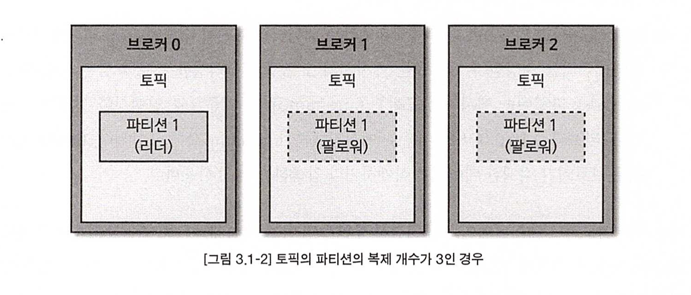
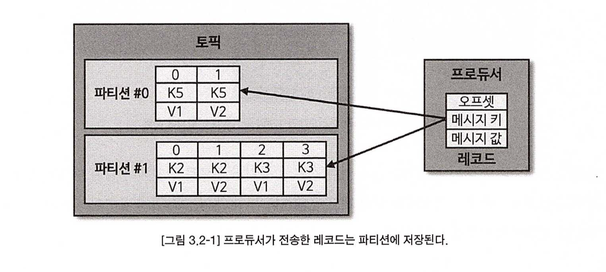
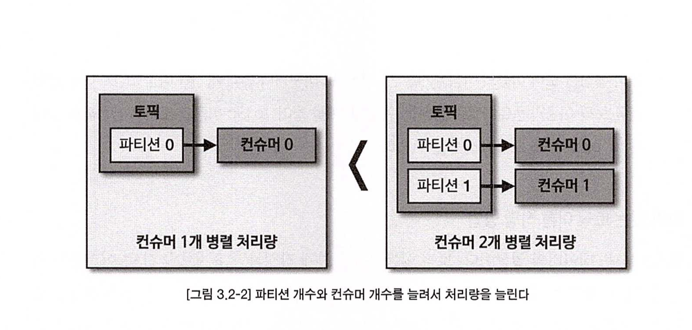

# 📌 서론

<aside>
✏️ 카푸카의 기본 개념에 대해서 알아보자.

</aside>

# 🔥 브로커

> 클라이언트와 데이터를 `주고 받기 위한 주체`, 데이터를 `분산 저장`하여 장애가 발생하더라도 `안전하게 운영`할 수 있도록 도와주는 애플리케이션이다. 운영환경에서 안정성을 위해 기본적으로 `3대 이상의 브러커`로 `클러스터를 구성`하여 사용한다.
>

## 데이터 저장 및 전송

프로듀서로 부터 데이터를 전달 받으면 카프카 브로커는 `프로듀서가 요청`한 `토픽`의 `파티션`에 **데이터를 저장**하고 `컨슈머`가 데이터를 요청하면 `파티션에 저장된 데이터를 전달`한다.

이때 프로듀서로 전달된 데이터는 파일 시스템에 저장된다.

### 간단 테스트

새로운 토픽을 생성하고 프로듀서로 데이터를 전달해 보자.

```bash
bin/kafka-topics.sh --create --bootstrap-server localhost:9092 \
--partitions 2 \
--topic **jshan-topic**
```

```bash
bin/kafka-console-producer.sh \
--bootstrap-server localhost:9092 \
--topic **jshan-topic** \
--property "parse.key=true" \
--property "key.separator=:"
```

```
key1:value1
key2:value2
key3:value3
```

로그 확인

뭔가 깨진 데이터가 나오지만 프로듀서에 의해 전달된 key value 값이 저장된 것을 확인 할 수 있다.

```bash
cd /kafka/kafka-logs-4c66cff66aa0/jshan-topic-0
cat 00000000000000000000.log
B���.����Y����Y��������������key1
                                 value1

cd /kafka/kafka-logs-4c66cff66aa0/jshan-topic-1
cat 00000000000000000000.log
B��
   �����������������������key2
                              value2B�������+����+���������������key3
```

## 페이지 캐시

카프카는 별도 메모리나 데이터 베이스를 사용하지 않고 파일로 저장하는데 이로 인한 `I/O 속도 이슈`를 걱정할 수 있다.

일단 OS에서 사용되는 `페이지 캐시`라는 기술을 이용하여 디스크 `입출력 속도를 높이고` 추가로 JVM이 메모리 관리를 하지 않아도 됨으로써 GC나 네트워크에서 발생되는 오버헤드를 줄일 수 있다는 장점이 있다.

다만 여기서 좀 드는 생각은 결국 OS의 페이지 캐시에 의존이 되므로 `페이지 캐시를 튜닝`해야될 상황이 올수도 있을 것 같다.

## 데이터 복제 & 싱크

- 클러스터로 구성되는 브로커는 `파티션단위`로 데이터가 `복제` 된다.
    - 토픽을 생성할 때 복제 개수(replication factor)도 같이 설정됨.
        - 만약 입력하지 않으면 `브로커에 설정된 옵션 값`을 따라감.
            - 최소 값은 1, `최댓값은 브로커 개수`만큼 설정이 가능



- 복제된 파티션은 `리더`와 `팔로워`로 구성됨.
- `리더`는 프로듀서, 컨슈머와 `직접 통신`하는 파티션
- `팔로워`는 리더의 `복제 데이터`를 가지고 있다.
    - 팔로워는 현재 자신이 가지고 있는 오프셋과 차이가 있을 경우 리더 파티션으로부터 데이터를 가져온다.
    - 팔로워 개수만큼 데이터가 복제되므로 저장용량이 증가되는 단점이 있지만 데이터 유실등의 안전성과 트레이드 오프 된다.
- 만약 리더 파티션이 속해 있는 브로커가 다운될 경우 팔로워중 하나가 리더 파티션을 넘겨 받는다.
    - 데이터는 계속 싱크되고 있으므로 큰 다운타임 없이 프로듀서와 컨슈머와 통신할 수 있다.
    - 🤔 만약 2개 이상이라면 랜덤으로 선택되는 건가??

## 컨트롤러

- 클러스터의 다수 브로커 중 한대가 컨트롤러 역활을 함.
    - 보통 `config 서버를 따로` 두는 것이 많던데 그냥 클러스터중 한대가 컨트롤러 역활을 수행 함.
- 다른 브로커의 `상태를 체크`하고 클러스터에서 빼낼지를 결정한다.
    - 만약 클러스터에서 빼내야 한다면 해당 브로커의 `리더 파티션을 재 분배` 한다.
- 만약 컨트롤러 역활을 하는 브로커에 `장애가 발생`한다면 `다른 브로커가 컨트롤러 역활`을 받는다.

## 삭제

- 기존 큐와는 다르게 데이터를 poll 하더라도 `데이터가 삭제되지 않는다.`
- `프로듀서`와 `컨슈머`는 데이터 `삭제를 할 수 없다.`
- `브로커만` 데이터를 `삭제할 수 있고` 파일단위로 삭제 된다.
    - 이 파일 단위를 `로그 세그먼트`라고 부른다.
    - 다수의 데이터가 들어가 있으므로 선별해서 삭제하는 것은 불가능하다.
    - 세그먼트는 데이터가 쌓이는 동안 파일 시스템으로 열려 있으므로 특정 조건에 의해서 세그먼트 파일을 닫아야 한다. 아래는 세그먼트 파일이 닫히는 옵션 값
        - log.segment.bytes - 특정 용량에 도달했을 때
        - log.segment.ms - 특정 시간이되었을 때
        - 너무 작은 용량이 너무 짧은 시간으로 설정하면 파일을 자주 여닫음으로써 부하가 생길 수 있음.
    - 닫힌 세그먼트는 아래 옵션값에 의해 삭제 된다.
        - log.retention.bytes
        - log.retention.ms
            - log.retention.hours 같은 옵션이지만 시간 단위
            - log.retention.minutes 같은 옵션이지만 분 단위
        - [log.retention.check.interval.ms](http://log.retention.check.interval.ms) 는 닫힌 세그먼트 파일을 체크하는 간격

기본적으로 `server.properties` 에 저장되어 있다.

```bash
vi /opt/kafka_2.12-2.5.0/config/server.properties

...
# The minimum age of a log file to be eligible for deletion due to age
log.retention.hours=168

# A size-based retention policy for logs. Segments are pruned from the log unless the remaining
# segments drop below log.retention.bytes. Functions independently of log.retention.hours.
#log.retention.bytes=1073741824

# The maximum size of a log segment file. When this size is reached a new log segment will be created.
log.segment.bytes=1073741824

# The interval at which log segments are checked to see if they can be deleted according
# to the retention policies
log.retention.check.interval.ms=300000
```

## 코디네이터

- 클러스터의 다수 브로커 중 한대는 코디네이터 역활을 수행
- 컨슈머 그룹의 상태를 체크 `파티션`을 `컨슈머와 매칭`되도록 분배하는 역활.
- 컨슈머가 그룹에서 빠지면 정상 동작하는 컨슈머로 할당하여 다운되지 않고 운영되도록 도와줌.
    - 일련의 과정을 `리밸런스`라 한다.

# 토픽과 파티션

토픽은 카프카에서 데이터를 구분하기 위해 사용하는 단위. 토픽은 한개 이상의 파티션을 소유하고 있다.



파티션은 카프카 병렬처리의 핵심

데이터 양이 많다면 파티션 개수와 컨슈머 개수를 늘린다면 처리량이 증가하는 효과를 볼 수 있음.

- 다만 무작정 늘리는 것이 정답은 아님. 결국엔 컨슈머에서 처리된 데이터가 다른 스토리지나 다른 미들웨어를 사용한다면 그 환경에 맞게 스케일 아웃을 해야 될 것 같다.



# 레코드

레코드는 아래와 같이 구성 됨.

- 타임스탬프
    - 브로커의 유닉스 시간으로 설정된다.
- 메시지 키
- 메시지 값
- 오프셋
    - 0이상의 숫자로 이루어져 있다.
    - 브로커에 저장될 때 이전에 전송된 레코드의 오프셋 + 1 값으로 생성.
    - 컨슈머가 데이터를 가져갈 때 사용된다.

브로커에 적재된 레코드는 수정할 수 없다.

## 메시지 키

- 용도는 값을 `순서대로` 처리하거나 `메시지의 종류`를 나타내기 위해 사용 됨.
- 메시지 키는 `해시값`으로 변환하여 파티션을 지정 함.
    - 동일한 키라면 동일한 파티션으로 저장.
    - 어느 파티션으로 저장되는지는 알 수 없다.
    - `파티션 개수가 변경`되면 파티션 `매칭이 달라질` 수 있다.

## 메시지

실질적 처리할 데이터가 들어 있고 메시지 `키와 값은 직렬화` 되어 있어 브로커로 전송되고 컨슈머에서는 반대로 역직렬화를 수행하므로 프로듀서와 컨슈머는 동일한 형태로 처리해야 됨.

- 레코드 오프셋은 0이상의 숫자로 이루어져 있다.
    - 레코드의 오프셋은 직접 지정할 수 없음.
    - 브로커로 전달될 때 이전 레코드의 오프셋 +1 값으로 생성 됨.
    - 오프셋은 컨슈머가 데이터를 가져갈 때 사용 함.
- 오프셋을 사용하면 컨슈머 그룹으로 이루어진 컨슈머들이 데이터를 어디까지 가져갔는지 명확히 지정 가능
    - 🤔 이건 실습이 필요해 보임.

# 🚀 결론

- 대체 큰 틀에서는 다른 시스템과 다르지 않다는 점을 알 수 있다.
- 기존에 시스템에 비해 간소화할 부분은 간소화 되었다.
    - config, 컨트롤러를 따로 분리 하지 않은 부분
- 컨슈머 오프셋이라는 개념으로 데이터를 가져가는데 이는 실습을 통해 노하우가 좀 필요해 보인다.
    - 재처리라던지 오프셋을 어떻게 관리할지 그런 부분들에 대해 학습이 추가적으로 필요하다 느낌.
- 데이터 삭제의 부분도 운영상 적지 않게 정책이 필요해 보인다.
    - 데이터 보관 기간이나 아니면 특정 데이터는 로우 데이터 형태로 보관 그 이상은 압축해서 보관 등.