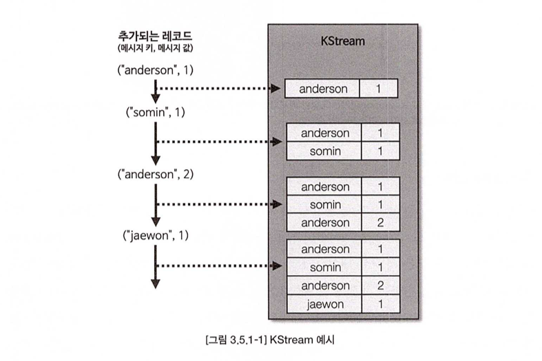
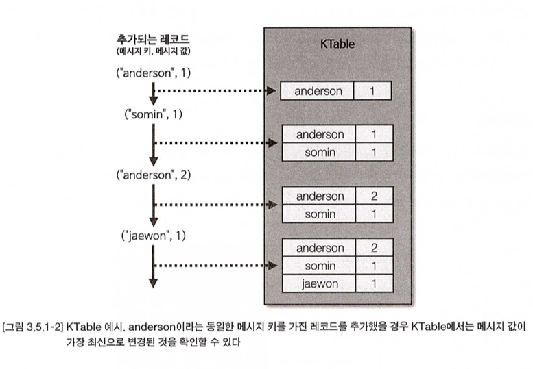

# 📌 서론

<aside>
✏️ 실시간으로 데이터를 처리해주는 카프카 스트림즈와 템플릿 형태의 개발을 가능하게 해주는 카프카 커넥트에 대해서 알아보자.

</aside>

# 🔥 카프카 스트림즈

> 토픽에 적재된 데이터를 `실시간으로 변환`하여 다른 토픽에 적재하는 라이브러리.
>

## 스트림즈 사용이유?

- 아파치 스파크, 플링크, 스톰, 플루언트디 와 같은 `다양한 오픈소스`가 존재 함.
    - 필요에 따라서 이를 사용하는 것도 고려
- `공식적`으로 지원하는 라이브러리
    - 카프카 버전이 오를 때마다 같이 릴리지 됨으로써 `완벽한 호환`이 됨.
    - 카프카 `매커니즘`과 `개발 철학`을 그대로 이어가므로 `운영 안정성`이 뛰어남.

## 스트림즈 DSL

> 스트림즈 DSL에는 레코드의 흐름을 추상화한 3가지 개념인 KStream, KTable, GlobalKTable이 있다.
>

### KStream

- 레코드의 흐름을 표현한 것으로 `메시지 키와 값`으로 구성됨.
- 조회시 토픽에 존재하는 `모든 레코드가 출력`
- `컨슈머로 토픽을 구독`하는 것과 동일한 선상에서 사용하는 것으로 볼 수 있음.

  

### KTable

- `메시지 키를 기준`으로 묶어서 사용 함.
- 유니크한 메시지 키를 기준으로 `가장 최신`의 레코드를 사용함.
    - 메시지 키를 기준으로 조회 시 `가장 마지막`에 추가된 레코드 데이터가 출력.
- 새로운 데이터를 적재할 때 `동일한 메시지 키`가 있을 경우 데이터가 `업데이트` 됨.


### GlobalKTable

- KTable과 동일하게 메시지 키를 기준으로 묶어서 사용.
- KTable은 선언된 토픽은 `1개의 파티션`이 1개의 태스크와 할당됨
- GlobalKtable로 선언된 토픽은 `모든 파티션` 데이터가 각 태스크에 할당되어 사용.
- 주로 조인할 때 사용됨.
    - 조인할때 토픽의 `파티션 개수`와 `파티션 전략`이 동일해야 조인이 가능.
        - 만약 파티션 개수나 전략이 다르면 조인이 불가능하고 리파티셔닝 과정을 거쳐 코파티셔닝되도록 작업이 필요.
    - GlobalKTable을 사용하면 코파티셔닝되지 않은 KStream, KTable 과 조인이 가능하다.
        - 위에 언급한 것과 같이 모든 태스크에 동일하게 공유되어 사용중이기 때문
            - ？？？ 뭔말인지…
    - 적인 데이터일 경우에만 조인하자.
        - 모든 데이터를 저장하여 사용하므로 로컬 스토리지의 사용량 증가
        - 네트워크 부하
            - 왜?
        - 브로커 부하
            - 왜?
        - 데이터가 크다면 KTable을 리파티셔닝을 하자.

### 스트림즈DSL 주요 옵션

- [Apache Kafka](https://kafka.apache.org/documentation/#streamsconfigs)

### 스트림즈DSL - Stream to

> 가장 간단한 스트림 프로세싱은 특정 토픽의 데이터를 다른 토픽으로 전달하는 것
>

간단한 코드 작성

```java
package io.df.henry.example;

import java.util.Properties;
import org.apache.kafka.common.serialization.Serdes;
import org.apache.kafka.streams.KafkaStreams;
import org.apache.kafka.streams.StreamsBuilder;
import org.apache.kafka.streams.StreamsConfig;
import org.apache.kafka.streams.kstream.KStream;

public class SimpleStreamApplication {
// 애플리케이션 아이디 중복 x
  public static final String APPLICATION_NAME = "streams_application"; 
  public static final String BOOTSTRAP_SERVERS = "localhost:9092";
  public static final String STREAM_LOG = "stream_log";
  public static final String STREAM_LOG_COPY = "stream_log_copy";

  public static void main(String[] args){
    Properties props = new Properties();
    props.put(StreamsConfig.APPLICATION_ID_CONFIG, APPLICATION_NAME);
    props.put(StreamsConfig.BOOTSTRAP_SERVERS_CONFIG, BOOTSTRAP_SERVERS);

    // 메시지 값의 역직렬화 직렬화 String 포맷으로 지정함.
    props.put(StreamsConfig.DEFAULT_KEY_SERDE_CLASS_CONFIG, Serdes.String().getClass());
    props.put(StreamsConfig.DEFAULT_VALUE_SERDE_CLASS_CONFIG, Serdes.String().getClass());

    StreamsBuilder builder = new StreamsBuilder();
    KStream<String, String> streamLog = builder.stream(STREAM_LOG);
    // stream_log 토픽을 담은 KStream 객체를 다른 토픽으로 전송하기 위해 to 메소드 사용
    // KStream 인스턴스의 데이터들을 특정 토픽으로 저장하기 위한 용도로 사용한다.
    streamLog.to(STREAM_LOG_COPY);

    // 이 스트림즈 애플리케이션은 stream_log 토픽의 데이터를 stream_log_copy 토픽으로 전달 한다.
    KafkaStreams streams = new KafkaStreams(builder.build(), props);
    streams.start();
  }
}
```

토픽 생성

```bash
bin/kafka-topics.sh --create \
--bootstrap-server localhost:9092 \
--partitions 3 \
--topic stream_log
WARNING: Due to limitations in metric names, topics with a period ('.') or underscore ('_') could collide. To avoid issues it is best to use either, but not both.
Created topic stream_log.
```

프로듀서 데이터 삽입

```bash
bin/kafka-console-producer.sh --bootstrap-server localhost:9092 \
--topic stream_log

hello
kafka
stream
```

데이터 카피 확인

```bash
bin/kafka-console-consumer.sh --bootstrap-server localhost:9092 \
--topic **stream_log_copy** --from-beginning

hello
kfka
stream
```

### 스트림즈DSL - filter

> 토픽으로 들어온 문자열의 길이가 5보다 큰 경우만 필터링하는 애플리케이션을 만들어 보자.
>

코드 작성

```java
package io.df.henry.example;

import java.util.Properties;
import org.apache.kafka.common.serialization.Serdes;
import org.apache.kafka.streams.KafkaStreams;
import org.apache.kafka.streams.StreamsBuilder;
import org.apache.kafka.streams.StreamsConfig;
import org.apache.kafka.streams.kstream.KStream;

public class SimpleStreamsFilterApplication {
  public static final String APPLICATION_NAME = "streams-filter-application"; // 애플리케이션 아이디 중복 x
  public static final String BOOTSTRAP_SERVERS = "localhost:9092";
  public static final String STREAM_LOG = "stream_log";
  public static final String STREAM_LOG_FILTER = "stream_log_filter";

  public static void main(String[] args){
    Properties props = new Properties();
    props.put(StreamsConfig.APPLICATION_ID_CONFIG, APPLICATION_NAME);
    props.put(StreamsConfig.BOOTSTRAP_SERVERS_CONFIG, BOOTSTRAP_SERVERS);

    // 메시지 값의 역직렬화 직렬화 String 포맷으로 지정함.
    props.put(StreamsConfig.DEFAULT_KEY_SERDE_CLASS_CONFIG, Serdes.String().getClass());
    props.put(StreamsConfig.DEFAULT_VALUE_SERDE_CLASS_CONFIG, Serdes.String().getClass());

    StreamsBuilder builder = new StreamsBuilder();
    KStream<String, String> streamLog = builder.stream(STREAM_LOG);
    // filter 처리 로직
    KStream<String, String> streamFilter = streamLog.filter(
        (k, v) -> v.length() > 5);
    streamFilter.to(STREAM_LOG_FILTER);

    // 이 스트림즈 애플리케이션은 stream_log 토픽의 데이터를 stream_log_copy 토픽으로 전달 한다.
    KafkaStreams streams = new KafkaStreams(builder.build(), props);
    streams.start();
  }
}

```

테스트

글자가 5글자 초과된 데이터만 필터링 되어 볼 수 있다.

```bash
bin/kafka-console-producer.sh --bootstrap-server localhost:9092 \
--topic stream_log

hi
hello
wonyoung
streams
jongsang

bin/kafka-console-consumer.sh --bootstrap-server localhost:9092 \
--topic stream_log_filter --from-beginning

stream
wonyoung
streams
jongsang
```

## 프로세스 API

> 스트림즈 DSL보다 투박한 코드를 가지지만 토폴로지를 기준으로 데이터를 처리한다는 관점에서는 동일한 역활을 한다.
>

더 사용을 해봐야 겠지만 `더 로우한 API를 제공`하고 더 `복잡한 파이프라인을 구축`할 때 사용된다고 한다.

### DSL과 Processor API 차이점 (feat GPT)

Streams DSL과 Processor API의 차이점

1. **추상화 수준**:
    - **Streams DSL**: 더 높은 수준의 추상화를 제공하며, 일반적인 스트림 처리 작업을 쉽게 표현할 수 있습니다. 선언적인 방식으로 스트림 변환, 집계, 조인을 수행합니다.
    - **Processor API**: 낮은 수준의 추상화를 제공하여, 보다 세밀한 제어와 복잡한 처리 로직을 구현할 수 있습니다. 사용자 정의 프로세서를 통해 특정 로직을 직접 구현합니다.
2. **사용 편의성**:
    - **Streams DSL**: 직관적이고 사용하기 쉬우며, 복잡한 로직을 간단하게 표현할 수 있습니다. 일반적인 스트림 처리 작업에 적합합니다.
    - **Processor API**: 더 복잡하고 사용하기 어렵지만, 복잡한 처리 로직과 커스텀 로직을 구현할 수 있습니다. 특별한 요구사항이 있을 때 적합합니다.
3. **유연성**:
    - **Streams DSL**: 제한된 유연성을 제공하지만, 대부분의 일반적인 스트림 처리 작업에는 충분합니다.
    - **Processor API**: 높은 유연성을 제공하며, 스트림 처리 파이프라인을 세밀하게 제어할 수 있습니다.

결론

- **Streams DSL**은 직관적이고 사용하기 쉬우며, 일반적인 스트림 처리 작업에 적합합니다.
- **Processor API**는 더 복잡하고 세밀한 제어가 필요할 때 사용됩니다. 고유한 요구사항이 있는 경우에 유용합니다.

### 예제

[github 코드 참고](https://github.com/bnjjong/livid-kafka-example/tree/master/example/kafka-processor-api)

### 테스트

DSL과 마찬가지로 해당 코드를 실행 시키고 아래와 같이 테스트를 진행해 보자.

```bash
bin/kafka-console-producer.sh --bootstrap-server localhost:9092 \
--topic stream_log

jongsang
hello
my name is jongsang
```

5글자인 hello 는 Filter 처리가 된다.

```bash
bin/kafka-console-consumer.sh --bootstrap-server localhost:9092 \
--topic stream_log_filter --from-beginning

jongsang
my name is jongsang
```

# 🔥 카프카 커넥트

> 카프카 오픈소스에 포함된 툴 중 하나로 데이터 파이프라인 생성 시 반복 작업을 줄이고 효율적인 전송을 이루기 위한 애플리케이션.
>

## 특징

- 데이터 파이프라인 생성 시 반복 작업을 줄이고 효율적인 전송을 이루기 위한 애플리케이션이다.
- 커넥트는 특정한 작업 형태를 템플릿으로 만들어 놓은, 커넥터를 실행함으로써 반복 작업을 줄일 수 있다.
- 토픽 이름과, 파일 이름, 테이블 이름등을 파라미터로 받는 코드로 작성해 두면 추가 코드 작성이 필요 없음.
- `프로듀서의 역활`을 하는 `소스` 커넥터와 `컨슈머 역활`을 하는 `싱크` 커넥터로 나뉜다.
    - 대표적인 커넥터는 아래와 같다.
    - MySQL
    - S3
    - MongoDB
    - File
    - 추가적으로 오픈소스 커넥터도 있다.
        - HDFS 커넥터
        - AWS S3
        - JDBC 커넥터
        - 엘라스틱 커넥터
        - 등 100개 이상의 커넥터가 공개
            - [여기서](https://www.confluent.io/hub/) 검색 가능

- 커넥터를 사용하여 파이프라인을 생성할때 사용하는 옵션
    - 컨버터
        - 데이터를 처리를 하기 전에 스키마를 변경하도록 도와줌
            - jsonConverter, StringConverter 등
    - 트랜스폼
        - 데이터 처리 시 각 메시지 단위로 데이터를 간단하게 변환하기 위한 용도
            - json 데이터의 특정 키를 삭제 또는 추가 할 수 있음.
            - 기본 제공 트랜스폼으로 Cast, Drop, ExtractField 등이 있음.

- 커넥터를 실행하는 방법
    - 단일 모드 커넥트 (Standalone mode kafka connect)
        - 당연히 고가용성 되지 않음. → SPOF
        - 연습모드나 개발 환경등에서 사용
    - 분산 모드 커넥트 (Distributed mode kafka connect)
        - 클러스터 형태로 운영
        - 당연히 고가용성
        - 무중단 스케일 아웃

## 카프카 커넥트 REST API

| 요청 메서드 | 호출 경로 | 설명 |
| --- | --- | --- |
| GET | / | 실행 중인 커넥트 정보 확인 |
| GET | /connectors | 실행 중인 커넥터 이름 확인 |
| POST | /connectors | 새로운 커넥터 생성 요청 |
| GET | /connectors/{커넥터 이름} | 실행 중인 커넥터 정보 확인 |
| GET | /connectors/{커넥터 이름}/config | 실행 중인 커넥터의 설정값 확인 |
| PUT | /connectors/{커넥터 이름}/config | 실행 중인 커넥터 설정값 변경 요청 |
| GET | /connectors/{커넥터 이름}/status | 실행 중인 커넥터 상태 확인 |
| POST | /connectors/{커넥터 이름}/restart | 실행 중인 커넥터 재시작 요청 |
| PUT | /connectors/{커넥터 이름}/pause | 커넥터 일시 중지 요청 |
| PUT | /connectors/{커넥터 이름}/resume | 일시 중지된 커넥터 실행 요청 |
| DELETE | /connectors/{커넥터 이름}/ | 실행 중인 커넥터 종료 |
| GET | /connectors/{커넥터 이름}/tasks | 실행 중인 커넥터의 태스크 정보 확인 |
| GET | /connectors/{커넥터 이름}/tasks/{태스크 아이디}/status | 실행 중인 커넥터의 태스크 상태 확인 |
| POST | /connectors/{커넥터 이름}/tasks/{태스크 아이디}/restart | 실행 중인 커넥터의 태스크 재시작 요청 |
| GET | /connectors/{커넥터 이름}/topics | 커넥터별 연동된 토픽 정보 확인 |
| GET | /connector-plugins/ | 커넥터에 존재하는 커넥터 플러그인 확인 |
| PUT | /connector-plugins/{커넥터 플러그인 이름}/config/validate | 커넥터 생성 시 설정값 유효 여부 확인 |

## 단일 모드 커넥트

단일 모드 설정 파일인 `connect-standalone.properties` 파일을 수정해야 한다.

```bash
vi config/connect-standalone.properties
```

```bash

# 커넥트와 연동할 카프카 클러스터와 호스트 포트
bootstrap.servers=localhost:9092

# 데이터를 카프카로 저장할 때 또는 가져올때 사용할 컨버터
# key, value에 대해서 사용하지 않는다면 schemas 에서 false 설정
key.converter=org.apache.kafka.connect.json.JsonConverter
value.converter=org.apache.kafka.connect.json.JsonConverter
key.converter.schemas.enable=false
value.converter.schemas.enable=false

# 단일 모드의 경우 로컬 파일에 오프셋 정보를 저장함
# 소스 커넥터 또는 싱크 커넥터가 데이터를 처리 시점을 저장하기 위해 사용 함.
offset.storage.file.filename=/tmp/connect.offsets
# 태스크 처리 완료한 오프셋을 커밋하는 주기를 설정
offset.flush.interval.ms=10000

# 플러그인 형태로 추가할 커넥터의 디렉토리 주소를 입력
# 직접 개발 또는 오픈소스로 다운로드
# 콤마로 구분
# jar파일을 로드 함.
# 기본 주석 처리되어 있음.
# plugin.path=/usr/local/share/java,/usr/local/share/kafka/plugins,/opt/connectors,
```

단일 모드 커넥트는 `설정파일과 함께 정의`하여 실행해야 한다.

카프카에서 기본으로 제공하는 `파일 소스 커넥터`를 살펴 보자

```bash
vi config/connect-file-source.properties
```

```bash
# 커넥터 이름 지정 (유일해야 함)
name=local-file-source
# 커넥터 클래스 이름
connector.class=FileStreamSource
# 태스크 개수 
# 1이상 이면 병렬 처리
tasks.max=1
# 읽을 파일 위치
file=test.txt
# 데이터를 저장할 토픽의 이름
topic=connect-test
```

실행은 아래와 같이 입력하면 된다.

```bash
bin/connect-standalone.sh config/connect-standalone.properties \
config/connect-file-source.properties
```

## 분산 모드

2개 이상의 프로세스가 1개의 그룹으로 묶여서 운영 됨.

분산 모드 설정 파일인 `connect-distributed.properties` 파일을 살펴 보자

```bash

bootstrap.servers=localhost:9092

# 다수의 커넥트 프로세스들을 묶을 그룹 이름을 지정
group.id=connect-cluster

# 컨버터 싱글 모드와 상동
key.converter=org.apache.kafka.connect.json.JsonConverter
value.converter=org.apache.kafka.connect.json.JsonConverter
key.converter.schemas.enable=true
value.converter.schemas.enable=true

# 카프카 내부 토픽에 오프셋 정보를 저장
# 소스, 싱크 커넥터가 데이터 처리 시점을 저장하기 위해 사용
# 처리하는데 중요한 역활을 하므로 실제 운영시에는 3이상 값으러 설정하는 것이 좋음.
offset.storage.topic=connect-offsets
offset.storage.replication.factor=1
config.storage.topic=connect-configs
config.storage.replication.factor=1
status.storage.topic=connect-status
status.storage.replication.factor=1

# 태스크가 처리 완료한 오프셋을 커밋하는 주기
offset.flush.interval.ms=10000

# 플러그인 싱글 모드와 상동
# plugin.path=/usr/local/share/java,/usr/local/share/kafka/plugins,/opt/connectors,
#plugin.path=
```

분산 모드의 경우 실행 시 `커넥트 설정파일`만 있으면 된다.

```bash
bin/connect-distributed.sh config/connect-distributed.properties
```

> 이번 실습에서는 커넥트 프로세스를 1개로 실행했지만 상용환경에서 운영할 때는 2대 이상의 분리된 서버에서 서버마다 1개의 분산 모드 커넥트를 실행하는 것이 좋다.
>

이제 REST API 로 커넥터의 `상태나, 생성, 조회, 수정` 등의 명령을 수행할 수 있다.

```bash
curl -X GET http://localhost:8083/connector-plugins
```

```json
[
    {
        "class": "org.apache.kafka.connect.file.FileStreamSinkConnector",
        "type": "sink",
        "version": "2.5.0"
    },
    {
        "class": "org.apache.kafka.connect.file.FileStreamSourceConnector",
        "type": "source",
        "version": "2.5.0"
    },
    {
        "class": "org.apache.kafka.connect.mirror.MirrorCheckpointConnector",
        "type": "source",
        "version": "1"
    },
    {
        "class": "org.apache.kafka.connect.mirror.MirrorHeartbeatConnector",
        "type": "source",
        "version": "1"
    },
    {
        "class": "org.apache.kafka.connect.mirror.MirrorSourceConnector",
        "type": "source",
        "version": "1"
    }
]

```

FileStreamSourceConnector를 실행

```bash
curl -X POST -H "Content-Type: application/json" \
--data '{
  "name": "local-file-source",
  "config": {
    "connector.class": "org.apache.kafka.connect.file.FileStreamSourceConnector",
    "file": "/tmp/test.txt",
    "tasks.max": "1",
    "topic": "connect-test"
  }
}' \
http://localhost:8083/connectors
```

```json
{
  "name": "local-file-source",
  "config": {
    "connector.class": "org.apache.kafka.connect.file.FileStreamSourceConnector",
    "file": "/tmp/test.txt",
    "tasks.max": "1",
    "topic": "connect-test",
    "name": "local-file-source"
  },
  "tasks": [],
  "type": "source"
}
```

커넥터 상태 확인

```bash
curl -X GET http://localhost:8083/connectors/local-file-source/status
```

```json
{
  "name": "local-file-source",
  "connector": {
    "state": "RUNNING",
    "worker_id": "172.18.0.3:8083"
  },
  "tasks": [
    {
      "id": 0,
      "state": "RUNNING",
      "worker_id": "172.18.0.3:8083"
    }
  ],
  "type": "source"
}
```

local-file-source 커넥터를 종료해 보자.

```bash
curl -X DELETE http://localhost:8083/connectors/local-file-source
```

완전히 중지가 되엇는지 확인할 수 있다.

`빈 배열`이 `출력`되었다면 실행중인 커넥터가 없다는 것을 의미 함.

```bash
curl -X GET http://localhost:8083/connectors
```

## 소스 커넥터

> 소스 커넥터는 소스 애플리케이션 또는 소스파일로 부터 데이터를 가져와 토픽으로 넣는 역활을 한다.
>
- 기본적으로 제공해주는 라이브러리가 존재
- 필요시 직접 개발을 할 수 있다.
    - SourceConnector, SourceTask 를 이용.
    - jar 파일로 빌드하여 플러그인 형태로 추가하여 사용할 수 있음.
- SourceConnector
    - 태스크를 실행하기전 설정 파일을 초기화, 어떤 태스크 클래스를 사용할지 결정
    - 실질적 데이터를 다루는 부분은 들어가지 않음.
- SourceTask
    - 소스 애플리케이션 또는 소스 파일에서 데이터를 가져와 토픽에 데이터를 보내는 역활을 한다.
    - 자체적 오프셋을 사용함.
        - 애플리케이션 또는 소스 파일에서 어디까지 읽었는지 저장하는 역활을 함.


## 싱크 커넥터

> 토픽의 데이터를 타깃 애플리케이션 또는 타깃 파일로 저장하는 역활을 한다.
>

라이브러리에서 `SinkConnector`와 `SinkTask` 클래스를 이용하여 직접 구현할 수 있음.

- SinkConnector
    - 태스크 실행전 설정값을 초기화 한다.
    - 어떤 태스크 클래스를 사용할 것인지 정의 한다.
- SinkTask
    - 실질적 데이터 처리하는 로직을 구현
    - 컨슈머 역활과 데이터 저장하는 로직을 가진다.

# 🔥 카프카 미러메이커2

> 서로 다른 두개의 카프카 클러스터 간에 토픽을 복제하는 애플리케이션이다.
>
- 미러메이커2를 사용하는 이유?
    - 토픽의 모든 것을 복제할 필요성이 있기 때문
    - 토픽에 있는 레코드는 고유한 메시지 키, 값, 파티션을 가짐
        - 프로듀서와 컨슈머를 사용하여 완벽하게 복제하는 것은 어려운 작업임.
        - 동일한 파티션에 동일한 레코드가 들어가도록 하는 작업은 클러스터에 사용하던 파티셔너 정보 없이는 불가능 함.
    - 토픽의 데이터만 복제 하는 것이 아니라 설정까지도 복제가 가능 함.
        - 파티션의 변화, 설정값의 변화도 동기화 가능.
    - 커넥터도 사용할 수 있도록 설계 됨.

# 🚀 결론

- Kafka 스트림은 현업에서도 매우 잘 활용할 수 있다는 생각이 들었다.
- DSL과 프로세스 API는 잘 익혀두면 Kafka 스트림을 구축하는데 도움이 될거라 생각이 든다.
- 추가로 커넥터도 재밌게 학습할 수 있었고 간단하게 카프카 어플리케이션을 구축하는데 도움을 주는 도구라 생각이 든다.
- 이런 도구를 잘 활용하려면 어쨌든 kafka 기본 핵심인 토픽과 파티션 프로듀서 컨슈머등을 잘 이해해야 할 것 같다.